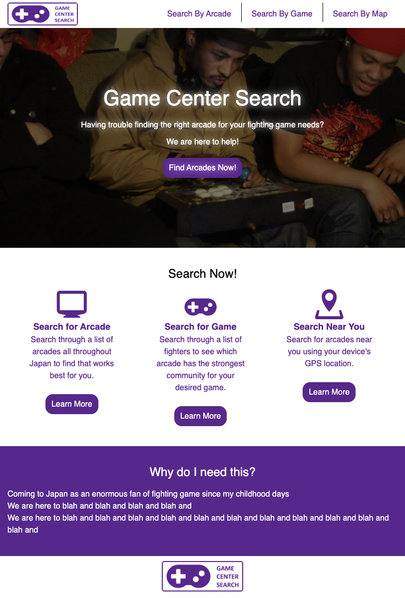
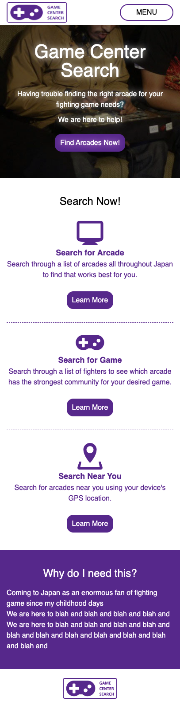

# Game-Center-Search-App
I love fighting games. I created this app to help me and others find the best fighting game arcades to go to in Tokyo.

## Page

| PC  | SP  |
|---|---|
|   |   |

## Setup
git clone https://github.com/PerryM123/Game-Center-Search-App.git

cd Game-Center-Search-App

npm install

npm start

## Dependancies

* React
* React DOM
* React Scripts (Ejected)
* Prop Types
* Google Maps React
* Styled Components
* Axios
* Sass Loader

## Early App UI/UX Flowchart

## Personal Milestones

### Closer to reach:

* Integrate testing (Jest)
* Prepping JSON data to be loaded into the app successfully (internally or externally)
* Google Maps integration with Pins
* Get a handle on transitioning between components cleanly
* Have a nice gradient design and color when designing app

### Harder to reach:

* Integrating Firebase/MangoDB (to learn how to handle things like "isLoggedIn()")
* Lazy Loading Components and Images

